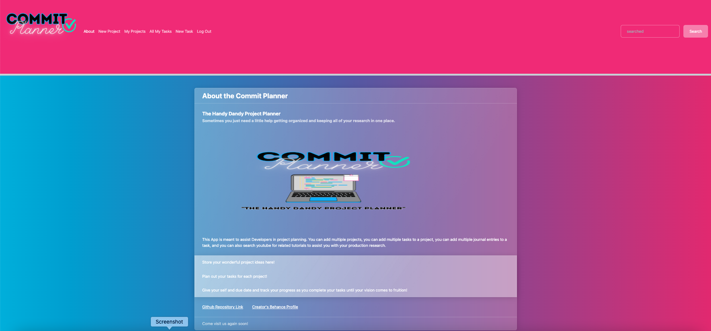
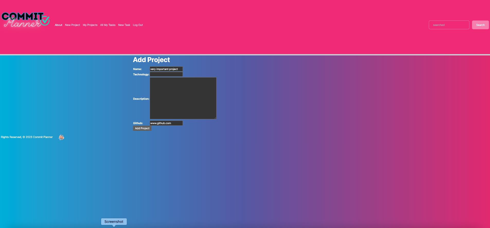
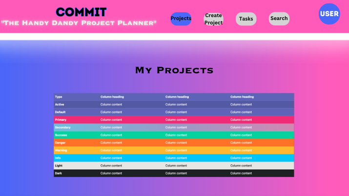
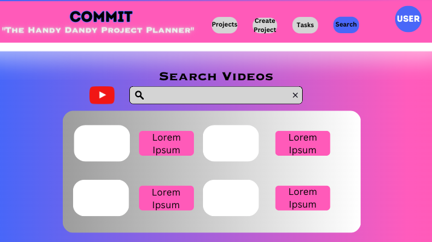

# App Title: 📓 Commit Planner 📓  (Django + Python fullstack app)
## Intro & Description :
 This is the best handy dandy planner ever! It's meant to assist developers in creating new projects and keeping their tasks organized. You can add tasks and assign them to your projects. You can even search for youtube tutorials in order to implement a feature or correct and error if needed. I hope you enjoy using it as much as I enjoyed making it!
 

## Screenshorts & WireFrame:

 App ScreenShots

WireFrames

## Technologies Used

Django, Python, CSS, Heroku, Github, bootswatch(bootstrap_), YouTube API ▶

## Getting Started :

My Trello Board:
<https://trello.com/b/EQsMva84/commit-app>

My App:
<https://commit-planner.herokuapp.com//>

## Icebox:
In the future I want to correct my api call and render it in a more user friendly way. I also want the user to be able to add images to their projects as well as add the pinterest or similar API in order to have an inspiration section for people to save pins and ideas for their projects. I also would change the structure of how to add tasks to projects for sure.
## Instructions :

You can fork and clone this repository if you are interested in creating your own version of this app. The logo's are proprietary so please use another logo for your application.  

### Contribution Guidelines: 
 
 If you would like to contribute to the project you can push your code and create a pull request. Some areas of improvement to focus on would be the sign in feature, the graph iframe, and the youtube iframe. In the future I am looking to add a page for blog posts and a page for NFT's. I also would like to use a different crypto API and the youtube API as well. 
